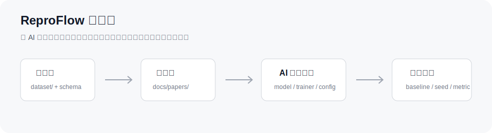
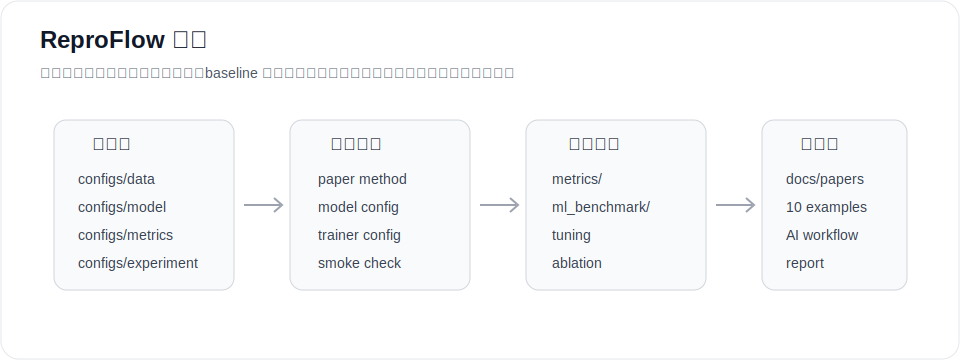

<div align="center">

# ReproFlow

**面向 AI 辅助论文复现的可复现实验框架**


</div>

ReproFlow 帮助深度学习初学者和 AI coding agent 把论文方法复现到自己的数据集上，并在统一的数据、指标、随机种子和 baseline 下进行公平对比。

<div align="center">
  <a href="./docs/reproflow_architecture.html"><strong>查看小白友好的项目架构说明</strong></a>
</div>



## 项目定位

现在 AI 已经很会写模型代码，但真实深度学习项目不只是“代码能跑”。最容易乱的是数据 schema、特征列、label、metric、seed、baseline、消融实验和日志输出。

ReproFlow 提供一个轻量、可配置、适合 AI 接入的实验基座：

```text
论文方法 -> 规范实现 -> 接入自定义数据集 -> 跑 baseline -> 多 seed / 消融 -> 输出可复现实验结果
```

面向小白的架构说明见 [docs/reproflow_architecture.html](./docs/reproflow_architecture.html)。

## 核心能力

- 自定义数据集：通过 `configs/data/*.yaml` 声明数据路径、label、特征列和 split。
- 常见任务：支持二分类、多分类、回归。
- 指标配置：通过 `configs/metrics/*.yaml` 选择评估指标，不在 trainer 里硬编码。
- 传统 ML baseline：保留 `run_ml_benchmark.py`，方便和深度学习方法公平对比。
- 多随机种子：`configs/tuning/`、`configs/ablation/`、`configs/experiment/` 都支持 `seeds: [...]`。
- 调参和消融：支持 grid/candidates tuning，也支持一等公民的 ablation runner。
- AI 复现规范：内置 `AGENTS.md`、`.claude/skills/`、`paper_methods/template/`。
- 简洁训练输出：默认只输出一个训练 log、一个 history CSV 和 best checkpoint。

## 架构



```text
Deeplearning-Framework/
├── main.py                 # Hydra 训练入口
├── Data_pre.py             # 数据读取、切分、预处理
├── Dataset.py              # PyTorch Dataset
├── engine.py               # 二分类 / 多分类 / 回归 trainer
├── models/                 # 深度学习模型
├── metrics/                # 指标注册与计算
├── ml_benchmark/           # 传统 ML baseline
├── configs/
│   ├── data/               # 数据 schema
│   ├── model/              # 模型参数
│   ├── trainer/            # trainer 选择
│   ├── metrics/            # 指标组合
│   ├── experiment/         # 公平对比实验
│   ├── tuning/             # 调参
│   └── ablation/           # 消融实验
├── docs/
│   ├── papers/             # 论文 PDF / Markdown
│   ├── architecture.md
│   └── ai_reproduction_guide.md
├── paper_methods/template/ # 论文方法模板
├── .claude/skills/         # 项目内置 AI skills
├── AGENTS.md               # AI agent 总入口
└── scripts/                # doctor / tuning / ablation / experiment / report 工具
```

## 快速开始

安装依赖：

```bash
pip install -r requirements.txt
```

生成示例数据：

```bash
python scripts/data/generate_synthetic_data.py
```

训练一个二分类模型：

```bash
python main.py data=sample_binary model=transformer trainer=binary metrics=default
```

训练多分类和回归：

```bash
python main.py data=sample_multiclass model=transformer trainer=multiclass metrics=default
python main.py data=sample_regression model=transformer trainer=regression metrics=default
```

## 默认输出

默认训练输出保持克制：

```text
result/<dataset>/<model>/training_<time>.log
result/<dataset>/<model>/history_<time>.csv
checkpoints/<dataset>/<model>.pth
```

也就是说，默认只有：

- 一个训练日志
- 一个 epoch-level history CSV
- 一个 best checkpoint

如果确实需要更详细的报告、预测文件或结构化 tracking，可以在命令行显式打开：

```bash
python main.py report.enabled=true artifacts.save_predictions=true artifacts.save_manifest=true
```

## 接入自己的数据集

把数据放进 `dataset/`，然后新增一个数据配置：

```yaml
# configs/data/my_task.yaml
name: my_task
path: dataset/my_task/data.csv
task_type: binary_classification
id_col: sample_id
label_col: label
numeric_cols: [age, price, count]
categorical_cols: [department, city]
text_cols: []
split:
  strategy: random
  train_ratio: 0.8
  random_state: 42
preprocess:
  scale_numeric: true
  encode_categorical: true
```

训练前先检查：

```bash
python scripts/doctor.py data=my_task model=transformer trainer=binary metrics=default
```

## 让 AI 复现论文

把论文放进：

```text
docs/papers/
```

生成论文方法模板：

```bash
python scripts/paper_methods/scaffold.py paper_xxx \
  --paper docs/papers/paper_xxx.pdf \
  --dataset my_task \
  --trainer binary
```

AI 实现时应遵守：

- `AGENTS.md`
- `docs/ai_reproduction_guide.md`
- `.claude/skills/reproflow-reproduce-paper/SKILL.md`
- `paper_methods/template/`

模型 forward contract 固定为：

```python
def forward(self, batch):
    return {"logits": logits}
```

## 传统 ML Baseline

在同一个数据配置上跑传统机器学习 baseline：

```bash
python run_ml_benchmark.py data=sample_binary
python run_ml_benchmark.py data=sample_regression
```

## 调参

调参配置位于 `configs/tuning/`：

```bash
python scripts/tuning/run_grid_search.py configs/tuning/transformer_binary_grid.yaml --dry-run
python scripts/tuning/run_grid_search.py configs/tuning/transformer_binary_grid.yaml --max-runs 1
```

示例：

```yaml
seeds: [42, 43, 44]
grid:
  model.hidden_dim: [32, 64]
  training_loop.learning_rate: [0.001, 0.0005]
```

## 消融实验

消融配置位于 `configs/ablation/`：

```bash
python scripts/ablation/run_ablation.py configs/ablation/transformer_binary_ablation.yaml --dry-run
```

示例：

```yaml
variants:
  - name: full
    overrides: {}
  - name: small_hidden
    overrides:
      model.hidden_dim: 32
seeds: [42, 43, 44]
```

## 公平对比实验

推荐用 `configs/experiment/*.yaml` 管理完整对比：

```bash
python scripts/experiment/run_experiment.py configs/experiment/binary_smoke.yaml --dry-run
python scripts/experiment/run_experiment.py configs/experiment/binary_smoke.yaml --max-runs 1
```

它可以把深度学习方法和传统 ML baseline 放在同一组实验里，并统一 dataset、metric、seed 和输出目录。

## AI Skills

项目内置了给 AI agent 使用的工作流：

```text
.claude/skills/
├── reproflow-onboard-dataset
├── reproflow-reproduce-paper
├── reproflow-add-model
├── reproflow-add-metric
├── reproflow-run-fair-experiment
└── reproflow-debug-run
```

这些 skills 会引导 AI 按项目 contract 增量接入数据、模型、指标、消融和实验。

## 验证命令

```bash
python -m py_compile main.py Data_pre.py Dataset.py engine.py run_ml_benchmark.py
python scripts/doctor.py data=sample_binary model=transformer trainer=binary metrics=default training_loop.epochs=1
python main.py data=sample_binary model=transformer trainer=binary metrics=default training_loop.epochs=1
```

## 交流与贡献

欢迎提交 Issue、提出建议，或者补充新的模型、数据适配、指标、论文方法模板和实验配置。

如果你在使用过程中遇到问题，也可以通过邮箱联系我：

```text
2812156857@qq.com
```
